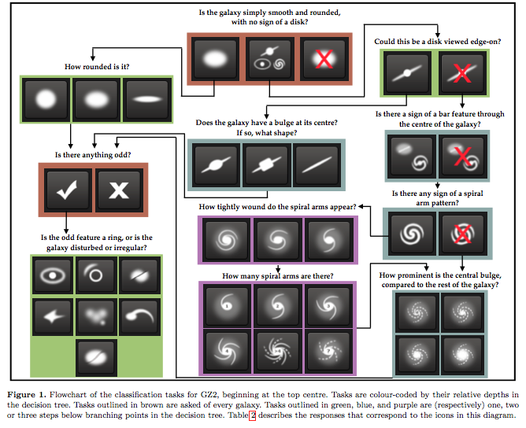
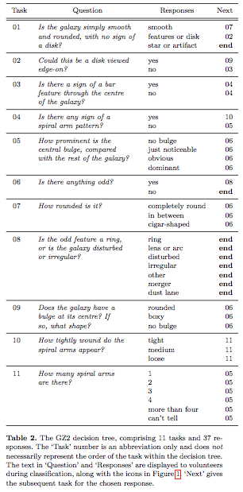
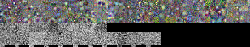
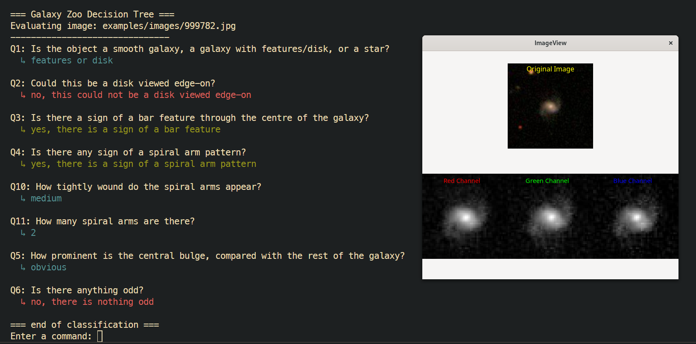

# Galaxy Zoo Classifier

The aim of this project is to implement a classifier for the Galaxy Zoo[1] dataset as described in the Kaggle competition [Galaxy Zoo - The Galaxy Challenge](https://www.kaggle.com/c/galaxy-zoo-the-galaxy-challenge)[2].

The classifier should be able to predict the type of galaxy based on this decision tree:



which corresponds to the following classes:

- Class1.1,Class1.2,Class1.3
- Class2.1,Class2.2
- Class3.1,Class3.2
- Class4.1,Class4.2
- Class5.1,Class5.2,Class5.3,Class5.4
- Class6.1,Class6.2
- Class7.1,Class7.2,Class7.3
- Class8.1,Class8.2,Class8.3,Class8.4,Class8.5,Class8.6,Class8.7
- Class9.1,Class9.2,Class9.3
- Class10.1,Class10.2,Class10.3
- Class11.1,Class11.2,Class11.3,Class11.4,Class11.5,Class11.6

The decision tree can also be represented by the following table:

 [3]

## Training

To train the CNNs run the training scripts in `src`:

```bash
julia src/_train_Q[num].jl
```

or train all the models:

```bash
julia src/__train_all.jl
```

or you can download the pretrained models by running

```bash
chmod +x getmodels.sh
./getmodels.sh
```

the models are saved in the `models/` directory in a `.bson` format.

The CNN architecture is defined as (inspired by [4]):

```julia
Chain(
	Conv((7, 7), 3 => 16, relu; pad = 3),
	MaxPool((2, 2)),
	
	Conv((3, 3), 16 => 16, relu; pad = 1),
	MaxPool((2, 2)),
	
	Conv((3, 3), 16 => 32, relu; pad = 1),
	MaxPool((2, 2)),
	
	Flux.flatten,
	Dense(32 * 6 * 6, 512, relu),
	Dropout(0.5),
	
	Dense(512, 256, relu),
	Dropout(0.5),
	Dense(256, 128, relu),
	Dropout(0.5),
	Dense(128, n_classes),
	Flux.softmax
)
```

and the trained kernels look like this:



## Classification

To classify an image, run the `GalaxyTree` classifier (or run `src/main.jl`):

```julia
include("GalaxyTree.jl")

using .GalaxyTree

GalaxyTree.classify("dataset/whirpool.jpg")
```
and the following classification will be printed:

```txt
=== Galaxy Zoo Decision Tree ===
Evaluating image: tests/test2.jpg
-------------------------------
Q1: Is the object a smooth galaxy, a galaxy with features/disk, or a star?
  ↳ features or disk

Q2: Could this be a disk viewed edge-on?
  ↳ no, this could not be a disk viewed edge-on

Q3: Is there a sign of a bar feature through the centre of the galaxy?
  ↳ yes, there is a sign of a bar feature

Q4: Is there any sign of a spiral arm pattern?
  ↳ no, there is no sign of a spiral arm pattern

Q5: How prominent is the central bulge, compared with the rest of the galaxy?
  ↳ just noticeable

Q6: Is there anything odd?
  ↳ no, there is nothing odd

=== end of classification ===
```

You can also run the CLI:

```bash
julia> include("src/env.jl")
julia> include("src/cli.jl")
julia> run_cli()
```

```txt
  <file path> - Classify the image at the given path.
  <URL> - Classify the image from the given URL.
  test? - Classify a random image from the testing folder.
  train? - Classify a random image from the training folder.
  help - Display help message.
  exit - Exit the CLI.
```


# References

[1] [Galaxy Zoo](https://www.galaxyzoo.org/)

[2] [Galaxy Zoo - The Galaxy Challenge (kaggle)](https://www.kaggle.com/c/galaxy-zoo-the-galaxy-challenge)

[3] [Galaxy Zoo 2: detailed morphological classifications for 304,122 galaxies from the Sloan Digital Sky Survey](https://arxiv.org/abs/1308.3496)

[4] [Applying a Deep Learning Approach to Galaxy Classification with Galaxy Zoo](https://medium.com/@thomas.mcrobie999/applying-a-deep-learning-approach-to-galaxy-classification-with-galaxy-zoo-2-afb51c81541f)

Jakub Pelc for [B0B36JUL](https://juliateachingctu.github.io/Julia-for-Optimization-and-Learning/stable/), 2024